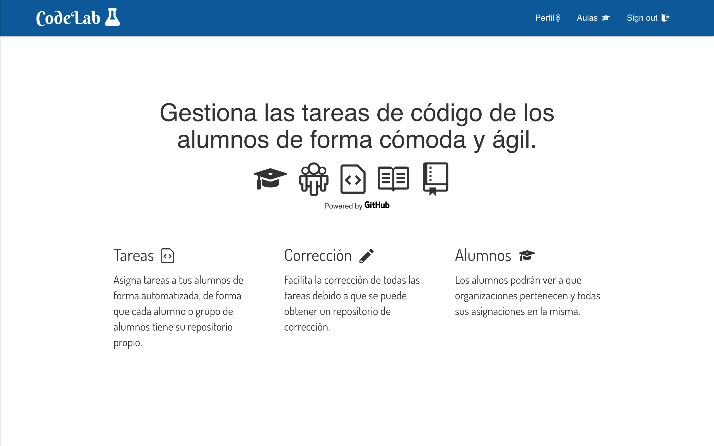

# TFG 17-18: CodeLab

[](https://github.com/standard/standard)

Codelab es una plataforma escrita usando Node.js, Express, MongoDB y la Github API para la gestión de tareas de código de forma cómoda y sencilla




## Prerequisitos

* Tener instalado Node.JS
* Tener instaladoMongoDB
* Tener una cuenta de Github
* Crear una OAuth app de github

## Instalación

En primer lugar clonamos el repositorio

```shell
$ git clone git@github.com:ULL-ESIT-GRADOII-TFG/samuel-ramos-tfg.git
```

Se debe crear una [`OAuth app de Github`](https://github.com/settings/applications/new), rellenando con el nombre, dirección de nuestra app y con el callbackURL que será `http://localhost:8081/login/github/return` La `OAuth app de Github` nos dará dos tokens, el `clientID` y el `clientSecret`.

Al ejecutar el siguiente comando, instalará todas las dependencias necesarias y creará un fichero `.env` con que debemos rellenar con el `clientID` `clientSecret` y el `callbackURL` de nuestra  `OAuth app de Github`.

```shell
$ npm run setup
```

En una terminal aparte ejecuta este comando (Asegurate tener mongo instalado y bien configurado)

```shell
$ mongod
```

Con el siguiente comando se pone en marcha el servidor.

```shell
$ npm start
```

## Despliegue

Desde el siguiente botón se puede desplegar la aplicación en heroku.

[](https://heroku.com/deploy)

## Dependecias

Mira la sección de dependencias en el [package.json](https://github.com/ULL-ESIT-GRADOII-TFG/samuel-ramos-tfg/blob/master/package.json) para más información

## Contributing

Para contribuir lee el fichero [CONTRIBUTING.md](https://gist.github.com/PurpleBooth/b24679402957c63ec426) 

Para más detalles consulta el [CODE_OF_CONDUCT.md](https://github.com/ULL-ESIT-GRADOII-TFG/samuel-ramos-tfg/blob/master/CODE_OF_CONDUCT.md)

## Contributors

* **Samuel Ramos Barroso** - *Alumno* - [Losnen](https://github.com/Losnen)
* **Casiano Rodríguez León** - *Tutor* - [Crguezl](https://github.com/crguezl)

Mira la lista de [contributors](https://github.com/ULL-ESIT-GRADOII-TFG/samuel-ramos-tfg/graphs/contributors) de este proyecto.

## License

Este proyecto está bajo licencia GPL-3.0 - Consulta [LICENSE.md](https://github.com/ULL-ESIT-GRADOII-TFG/samuel-ramos-tfg/blob/master/LICENSE) para más detalles

## Enlaces

* Accede la app en local desde este [enlace](http://localhost:8081/)
* Accede la app en Heroku desde este [enlace](https://codelab-tfg1718.herokuapp.com/)
* Repositorio de la [memoria](https://github.com/Losnen/memoria-tfg)